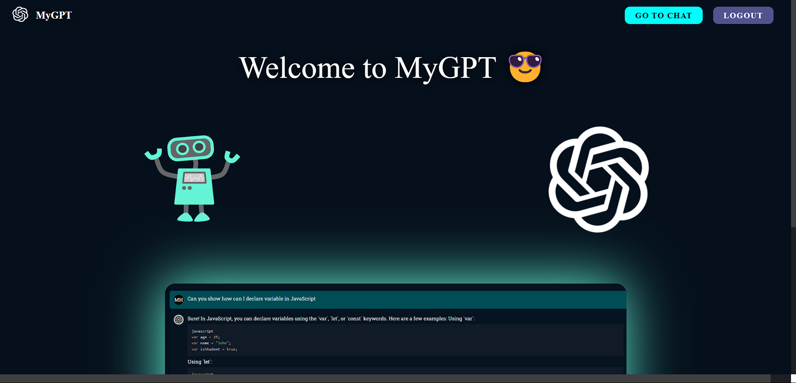
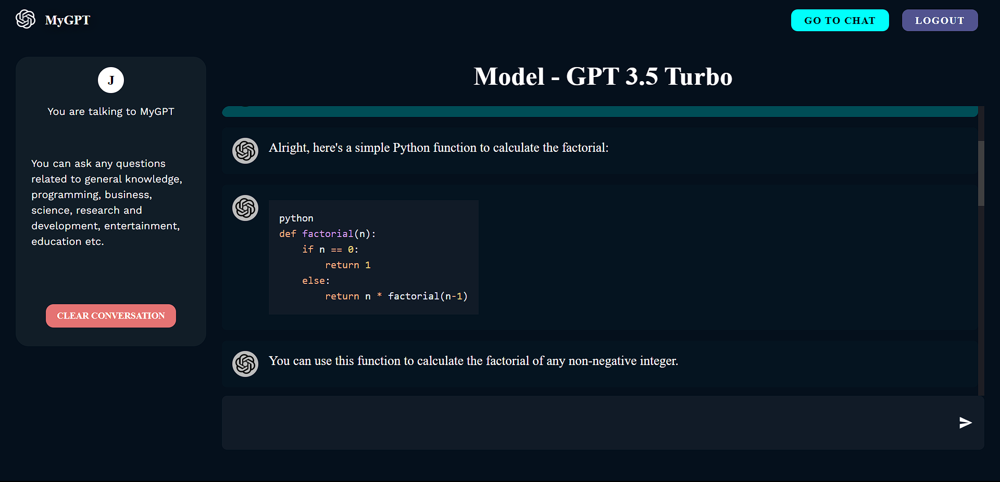
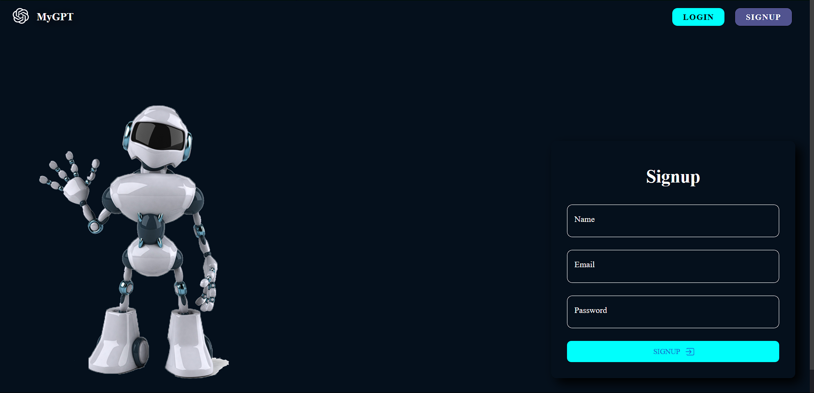

<h1 align="center">MyGPT - using OpenAI API</h1>
<h3 align="center">A failed attempt to make a ChatGPT clone using OpenAI API :)</h3>

# Features

  
  
- AI chatbot interaction (couldn't be implemented coz I didn't pay for the API key, lolll).
- Secure user experience.
- Secure database to store user data & credentials.
- Storing user chat history.
 
 

# Concepts Learned

- Building web applications using Typescript.
 
 
- Developing interactive UI design using React.js, CSS3 & MaterialUI.
- Building a MongoDB integrated backend server to handle client-side requests and store user data in the DB.
- Implementing secure web-protocols like JWT-authentication, HTTP-only-cookies, Hashing of passwords, etc.
- Using backend controllers and client-side React state managers, including Axios to ensure seamless integration of the backend with frontend.
- Calling OpenAI API's chatgpt-turbo-3.5 endpoint to implement an end-to-end conversation chatbot.
- Version Control using GitHub.

# Tech Stack

        

# Demo

# Footnote

The Domain of development is not always fun and games. It can get hard and frustrating at times, and when your application doesn't work coz you didn't pay for the API key, it hurts more :) But the secret to strive is actually "Strive more, Just GO AHEADDD!". Although this website couldn't be completed, yet it was a great learning experience as it introduced me to interesting concepts like Web security protocols, securing websites & DBs, as well as the totally new & trending language - Typescript. It was a great learning experience!
